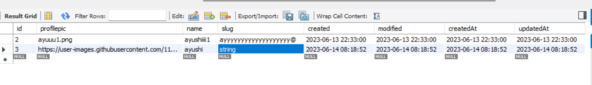
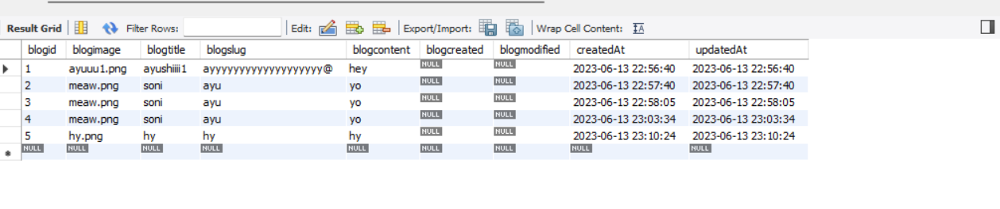

# JOONWEB ASSIGNMENT

# Nodejs

- Node.js is an open-source, server-side JavaScript runtime environment that allows you to run JavaScript code outside of a web browser
-

# Express

- Express is just a framework, that can help us in creating the server in very easy way

# Mysql

- MySQL is an open-source relational database management system (RDBMS) that allows you to store, organize, and manage structured data

# REQUIREMENTS

- User can register
- Retrieves a list of all user
- Updates an existing user
- deletes an existing user
- Able to create a new blog post
- Able to Retrieves a list of blogs by specific id
- Able to Retrieves a list of all the blogs
- Updates an existing blog specified by id

## Setting up Mysql with Express Nodejs

---

### To run Mysql with Express Nodejs , follow these steps:->

#### Creating First Server

- It is not an inbuilt module of node, so we have to install it using `npm`
- Create a node project by `npm init -y` .
- Create a file named `index.js` .
- Initialise a node project and install `nodemon`
- Install `express`
- Install some more dependencies `dotenv`, `mysql2`, `sequelize`,`sequelize-cli` ny npm install
- `npx sequilize-cli` npm install
- `npx sequelize-cli db:migrate `

* To run Mysql server with Express Node

- `nodemon server`

# Tech Stack Used: -

## Backend : -

| Node.js                                                                                                                         | Express.js                                                                                                                      | Mysql                                                                                                                               |     |
| ------------------------------------------------------------------------------------------------------------------------------- | ------------------------------------------------------------------------------------------------------------------------------- | ----------------------------------------------------------------------------------------------------------------------------------- | --- |
|  |  |  |


## created table user :



## created table blog



# User Schema

```
 id: {
            type: DataTypes.INTEGER,
            primaryKey: true,
            autoIncrement: true,
        },
        profilepic: {
            type: DataTypes.STRING,
        },
        name: {
            type: DataTypes.STRING,
            allowNull: false,
        },
        slug: {
            type: DataTypes.STRING,
        },
        created: {
            type: DataTypes.DATE,
            defaultValue: DataTypes.NOW,
        },
        modified: {
            type: DataTypes.DATE,
            defaultValue: DataTypes.NOW,
        },

```

# UserModel

```

{
"profilepic": "https://user-images.githubusercontent.com/112753481/229047696-de3bf177-16a0-4161-a140-dd89e4fe7b22.png",
"name": "ayushi",
"slug": "string"
}

```

# BlogSchema

```
 blogid: {
            type: DataTypes.INTEGER,
            primaryKey: true,
            autoIncrement: true,
        },
        blogimage: {
            type: DataTypes.STRING,
        },
        blogtitle: {
            type: DataTypes.STRING,
        },
        blogslug: {
            type: DataTypes.STRING,
        },
        blogcontent: {
            type: DataTypes.TEXT,
        },
        blogcreated: {
            type: DataTypes.DATE,
        },
        blogmodified: {
            type: DataTypes.DATE,
        },
```

# BlogModel

```

{
"blogimage": "https://user-images.githubusercontent.com/112753481/229047696-de3bf177-16a0-4161-a140-dd89e4fe7b22.png",
"blogtitle": "hy",
"blogslug": "hy",
"blogcontent":"hy"
}

```

# Routes for users

- Post routes
  `http://localhost:8080/api/users`

  ## Create a new user

  ```
  {
    "profilepic": "https://user-images.githubusercontent.com/112753481/229047696-de3bf177-16a0-4161-a140-dd89e4fe7b22.png",
    "name": "ema",
    "slug": "cat"
  }
  ```

## Successful response of creating user

```
{
    "message": " User Successfully created Thanks for registering  👥",
    "data": {
        "created": "2023-06-14T08:52:50.975Z",
        "modified": "2023-06-14T08:52:50.975Z",
        "id": 2,
        "profilepic": "https://user-images.githubusercontent.com/112753481/229047696-de3bf177-16a0-4161-a140-dd89e4fe7b22.png",
        "name": "ema",
        "slug": "cat",
        "updatedAt": "2023-06-14T08:52:50.975Z",
        "createdAt": "2023-06-14T08:52:50.975Z"
    }
}
```

# Get Route

`http://localhost:8080/api/users`

## Successful result

```
{
    "message": " Here your all Users   👥",
    "User": [
        {
            "id": 1,
            "profilepic": "https://user-images.githubusercontent.com/112753481/229047696-de3bf177-16a0-4161-a140-dd89e4fe7b22.png",
            "name": "cat",
            "slug": "string",
            "created": "2023-06-14T08:52:33.000Z",
            "modified": "2023-06-14T08:52:33.000Z",
            "createdAt": "2023-06-14T08:52:33.000Z",
            "updatedAt": "2023-06-14T08:52:33.000Z"
        },
        {
            "id": 2,
            "profilepic": "https://user-images.githubusercontent.com/112753481/229047696-de3bf177-16a0-4161-a140-dd89e4fe7b22.png",
            "name": "ema",
            "slug": "cat",
            "created": "2023-06-14T08:52:50.000Z",
            "modified": "2023-06-14T08:52:50.000Z",
            "createdAt": "2023-06-14T08:52:50.000Z",
            "updatedAt": "2023-06-14T08:52:50.000Z"
        }
    ]
}
```

# Put Route

`http://localhost:8080/api/users/2`

```
{
    "profilepic": "https://user-images.githubusercontent.com/112753481/229047696-de3bf177-16a0-4161-a140-dd89e4fe7b22.png",
    "name": "doremon",
    "slug": "nobita"
}
```

## Successfull response

```
{
    "message": " Here you can update user details    👥",
    "User": [
        {
            "created": "2023-06-14T10:20:56.833Z",
            "modified": "2023-06-14T10:20:56.833Z",
            "id": "2",
            "profilepic": "https://user-images.githubusercontent.com/112753481/229047696-de3bf177-16a0-4161-a140-dd89e4fe7b22.png",
            "name": "doremon",
            "slug": "nobita"
        },
        false
    ]
}
```

# Delete Route

`http://localhost:8080/api/users/2`

# Blogs -> CRUD routes

# Create a new blog

`http://localhost:8080/api/blogs`

```
{
    "blogimage": "ayushi.png",
    "blogtitle": "ayushi",
    "blogslug": "ayushi",
    "blogcontent":"ayushi"
}

```

## Successfully created a new blog

```
{
    "message": "Successfully created blog data  👤",
    "data": {
        "blogid": 1,
        "blogimage": "ayushi.png",
        "blogtitle": "ayushi",
        "blogslug": "ayushi",
        "blogcontent": "ayushi",
        "updatedAt": "2023-06-14T10:14:27.746Z",
        "createdAt": "2023-06-14T10:14:27.746Z"
    }
}

```

# Get Routes

`http://localhost:8080/api/blogs`

## Response Status

```
{
    "message": " Here your all Blogs   👥",
    "User": [
        {
            "blogid": 1,
            "blogimage": "ayushi.png",
            "blogtitle": "ayushi",
            "blogslug": "ayushi",
            "blogcontent": "ayushi",
            "blogcreated": null,
            "blogmodified": null,
            "createdAt": "2023-06-14T10:14:27.000Z",
            "updatedAt": "2023-06-14T10:14:27.000Z"
        }
    ]
}
```

# Get Routes by Specific id

`http://localhost:8080/api/blogs/1`

## Response Status

```
{
    "message": " Here your all blogs by specific id   👥",
    "User": [
        {
            "blogid": 1,
            "blogimage": "ayushi.png",
            "blogtitle": "ayushi",
            "blogslug": "ayushi",
            "blogcontent": "ayushi",
            "blogcreated": null,
            "blogmodified": null,
            "createdAt": "2023-06-14T10:14:27.000Z",
            "updatedAt": "2023-06-14T10:14:27.000Z"
        }
    ]
}

```

# Put Request

`http://localhost:8080/api/blogs/1`

# All routes

| METHOD | ENDPOINT       | DESCRIPTION                                                                                      | STATUS CODE |
| ------ | -------------- | ------------------------------------------------------------------------------------------------ | ----------- |
| POST   | /api/users     | This endpoint should allow users to register and create.                                         | 200         |
|        |                |
| GET    | /api/users     | This endpoint should return a list of all available users.                                       | 200         |
| PUT    | /api/users/:id | This endpoint should allow to update the details of a specific users identified by its ID.       | 200         |
| DELETE | /api/users/:id | This endpoint should allow to users to delete details to the system.                             | 200         |
| PUT    | /api/blogs/:id | This endpoint should allow users to update the details of a specific blogs identified by its ID. | 200         |
| GET    | /api/blogs/:id | This endpoint should allow users to delete a specific blogs identified by its ID.                | 200         |
| POST   | /api/blogs     | This endpoint should allow the user to create the blogs.                                         | 200         |
| GET    | /api/blogs     | This point should list all the blogs so far with the user and blogs details.                     | 200         |


